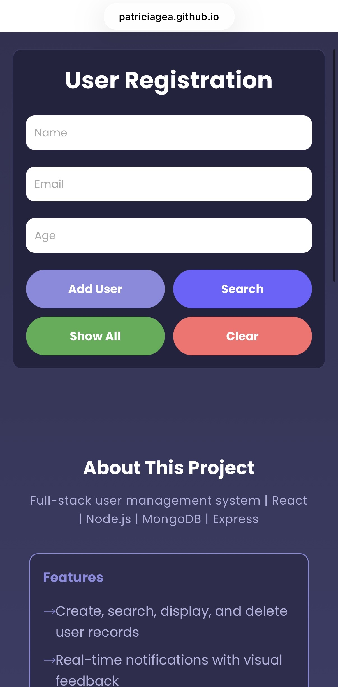

# User Registration System

<!-- REVIEW: Screenshot references `./public/IMG_8875.jpeg` but that file is not in `public/` — fix path or add the image so the README renders correctly. -->


> Full-stack user management app built for Course 5 at **Hyper Island, Stockholm** by **Patricia Gea**

A web app for managing user registrations with React, Node.js, and MongoDB. Users can create, search, edit, and delete records with real-time feedback.



---

## Features

- Create, search, edit, and delete user records (full CRUD)
- Real-time feedback messages for all actions
- Form validation (required fields)
- Edit mode with cancel option
- Loading state while fetching data
- Responsive design (desktop, tablet, mobile)
- Client-side routing with React Router (Home + About page)
- RESTful API with Express and MongoDB

---

## Technologies

**Frontend:** React | React Router | Vite | Axios | CSS3  
**Backend:** Node.js | Express | MongoDB | Mongoose  
**Tools:** Git | npm

---

## Quick Start

### Prerequisites

<!-- REVIEW: Frontend uses React 19 / Vite 7 — bump minimum Node recommendation (e.g. 18+) to match tooling support, not v14. -->

- Node.js (v14+) | MongoDB | npm

### Installation

```bash
# Clone the project
git clone <repository-url>

# Install frontend dependencies
npm install

# Install backend dependencies
cd api_users
npm install
```

### Running

```bash
# Terminal 1 - Start the API
cd api_users
npm start
# Runs on http://localhost:3000

# Terminal 2 - Start the frontend
npm run dev
# Runs on http://localhost:5173
```

---

## API Endpoints

| Method | Endpoint                      | Description                                 |
| ------ | ----------------------------- | ------------------------------------------- |
| GET    | `/users`                      | Get all users or search with query params   |
| GET    | `/users?name=X&email=Y&age=Z` | Search users by name, email, or age         |
| POST   | `/users`                      | Create new user (name, email, age required) |
| PUT    | `/users/:id`                  | Update an existing user                     |
| DELETE | `/users/:id`                  | Delete user by ID                           |

---

## Project Structure

```
devClubCadastrouser/
├── api_users/                 # Backend API
│   ├── models/user.js         # User model (Mongoose)
│   ├── routes/users.js        # API routes
│   ├── db.js                  # Database connection
│   ├── server.js              # Express server
│   └── package.json
│
├── src/                       # Frontend (React)
│   ├── components/            # Reusable components
│   │   ├── MessageBanner.jsx  # Feedback messages
│   │   ├── UserCard.jsx       # Single user card
│   │   ├── UserField.jsx      # Label + value display
│   │   ├── UserForm.jsx       # Form with inputs and buttons
│   │   └── UserList.jsx       # List of user cards
│   ├── hooks/
│   │   └── useUsers.js        # Custom hook for API calls
│   ├── pages/
│   │   ├── Home/index.jsx     # Main page
│   │   └── About/index.jsx    # About page
│   ├── services/api.js        # Axios config
│   ├── main.jsx               # App entry with React Router
│   └── index.css              # Global styles
│
├── index.html
├── package.json
└── vite.config.js
```

---

## What I Learned

- **React:** useState, useRef, custom hooks, component decomposition, props, controlled inputs
- **Routing:** React Router with BrowserRouter, Routes, Route, and Link
- **Architecture:** Separating logic from UI with a custom hook (useUsers)
- **Backend:** Building a REST API with Express, connecting to MongoDB with Mongoose
- **Full-Stack:** Connecting a React frontend to a Node.js API with Axios

---

Made by **Patricia Gea** at **Hyper Island, Stockholm**

[GitHub](https://github.com/PatriciaGea) | [LinkedIn](https://www.linkedin.com/in/patriciageafrontend/) | [Project Repo](https://github.com/PatriciaGea/devClubCadastrouser)
